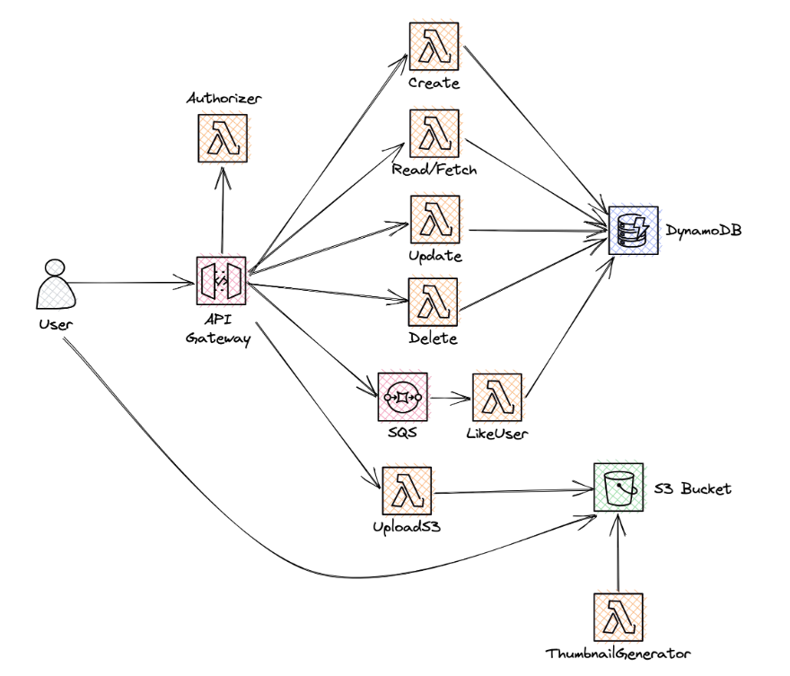
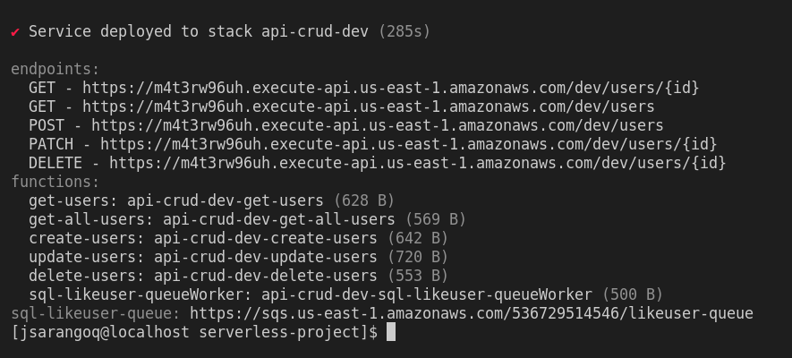

# Serverless Project



Project with serverless and lambda functions. This project, has 8 lambda functions what do the follow:

- Lambda 1: Create a user on dynanobd table
- Lambda 2:Read all users
- Lambda 3: Read one user with id
- Lambda 4: Update one user with id
- Lambda 5: Delete user with id
- Lambda 6: Through SQS, add 1 to counter of likes of a account
- Lambda 7: Signs a url to upload images to S3
- Lambda 8: Thumbnail generator of images uploaded to S3. It generate 3 thumbnail for each one uploaded image
- Lambda 9: Custom authorizer for API Gategay for POST method

Only the lambda function No. 5 (delete User) was implement with python. All others was implement with nodejs

## Framework used

Serverless framework with plugins:

- serverless-apigateway-service-proxy
- serverless-lift

## AWS Services Used

- API Gateway
- SQS
- DynamoDB
- Lambda Functions
- S3
- IAM

### Run project

1. Setup your local environment with the steps in the follow [link](https://www.serverless.com/framework/docs/getting-started)

2. Clone repo

```

git clone https://github.com/juliosarango/api-serverless.git
```

3. Deploy your project

```

sls deploy
```
After this command, AWS Cloud Formation setup all services and resoucres for you project runs. Its will take more of 1 minute.


In the image, you can see all endpoints and lambda functions what we have deployed to AWS. Now, you can test with postman or another api client.